# Segundo ejercicio de Eclemma (Caja Blanca) Días de la Semana con SWITCH.

El orden para hacer nuestras pruebas de caja blanca es: 

1. Grafo del flujo del programa.
   
2. Complejidad ciclomática.
   
3. Caminos independientes. Tabla con las siguientes columnas:
 - Número del camino
 - Nodos/aristas del camino
 - Prueba (valores de las condiciones)
 - Entrada (variables)
 - Salida (resultado esperado)

4. Ficheros .java del código.
   
5. Pantallazo de la vista Coverage con el 100% de cobertura en los métodos implicados (herramienta Eclemma). Muestra las vistas 100% de complejidad, ramas. líneas de código.

Descomponemos nuestro programa para poder hacer el grafo y nos será de utilidad:

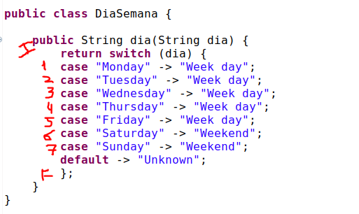

Una vez que tengamos nuestra programa con todos sus nodos haremos el grafo.

## Grafo del flujo

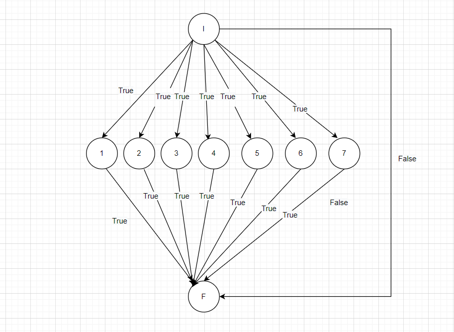

Se explicará más detalladamente el camino en el punto 3.

## Complejidad ciclomática

Hay 3 formas de hacer la complejidad:

### Método de las Aristas

La fórmula sería: (Aristas-Nodos)+2

Las aristas son las flechas que salen de que nodo (subrayado con amarillo).

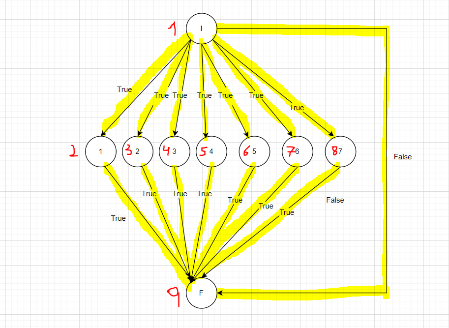

Y los nodos son las condiciones o resultados dados.(numerados en rojo)

Con lo cual la fórmula quedaría así:

VG = (A-N) +2

VG = (15-9) + 2

VG = 8

La complejidad resulta que es 3, en las otras 2 formas nos debe de salir lo mismo, para verificar que está bien.

### Método nodos Predicados

Son los nodos de los que salen 2 o más flechas.

La fórmula es:

VG = Nodos Predicados + 1
VG = 7+1 = 8

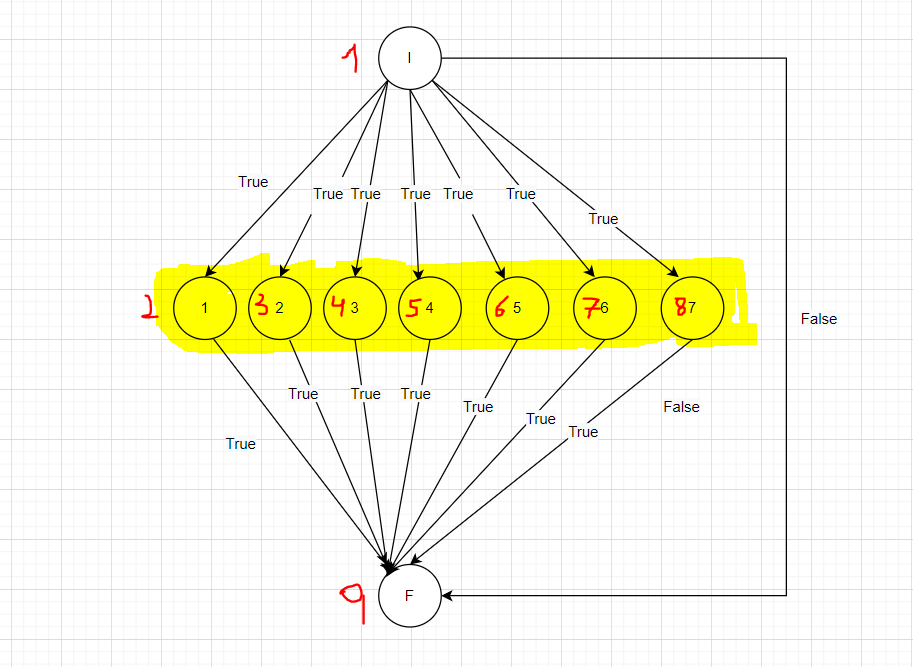

### Método de las Regiones

Regiones delimitadas por nodos y aristas. Se considera región la parte externa.

VG = 8

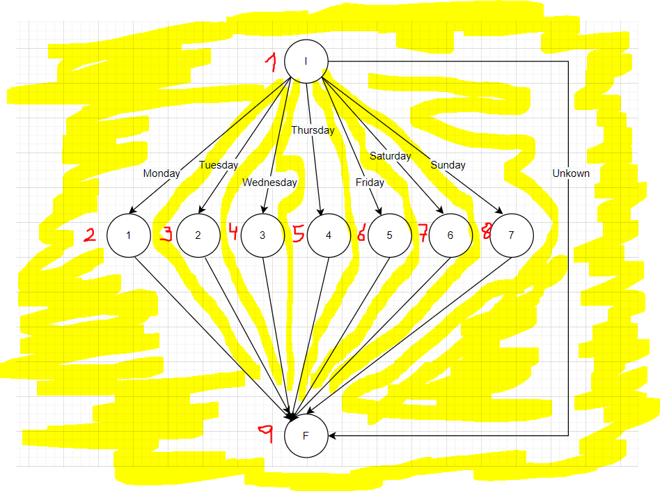

## Camino Independiente

En cada camino se ha de añadir una arista nueva. 

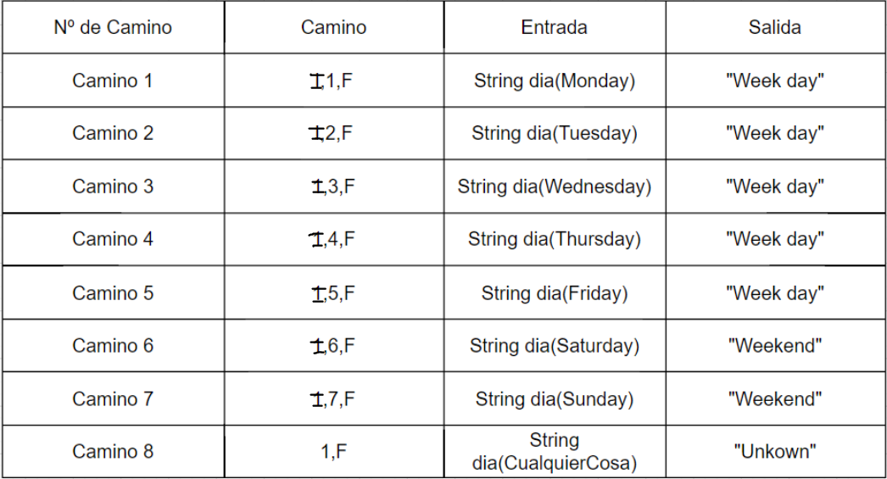

## Ficheros .java

[DiaSemana.java](../src/diaSemana/DiaSemana.java)

[DíaSemanaTest.java](../src/diaSemana/DiaSemanaTest.java)

## Pantallazo con las Vistas

Aquí lo que pretendemos es que cada camino quede cubierto, con su correspondiente prueba de Junit y eclemma. Debe ser lo más cercano Posible al 100%.

### Vistas con 100% en test y clase

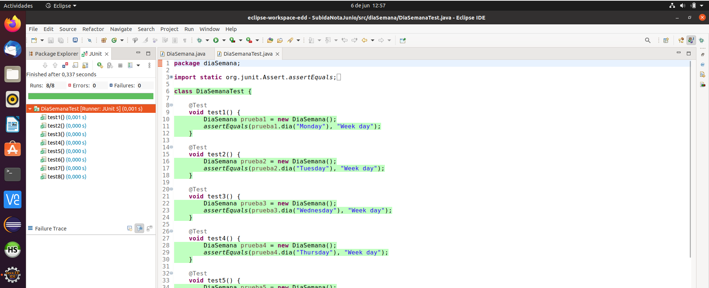

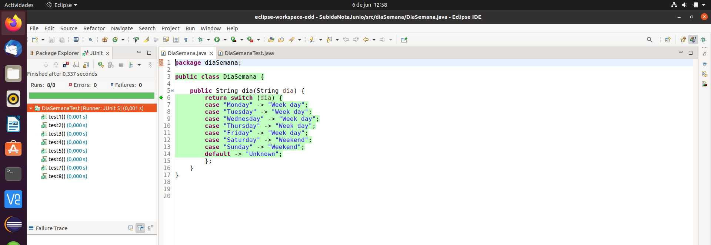

### Instrucciones código bytes

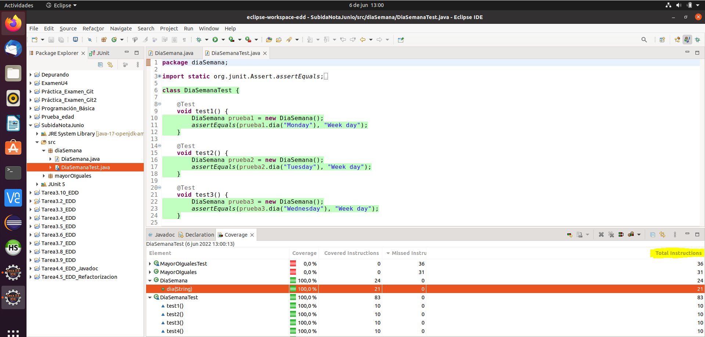

### Ramas

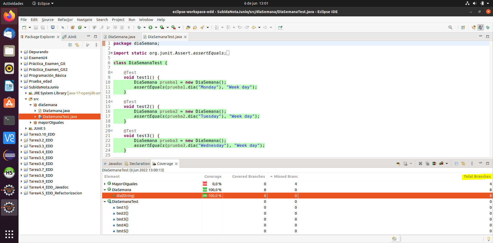

### Líneas

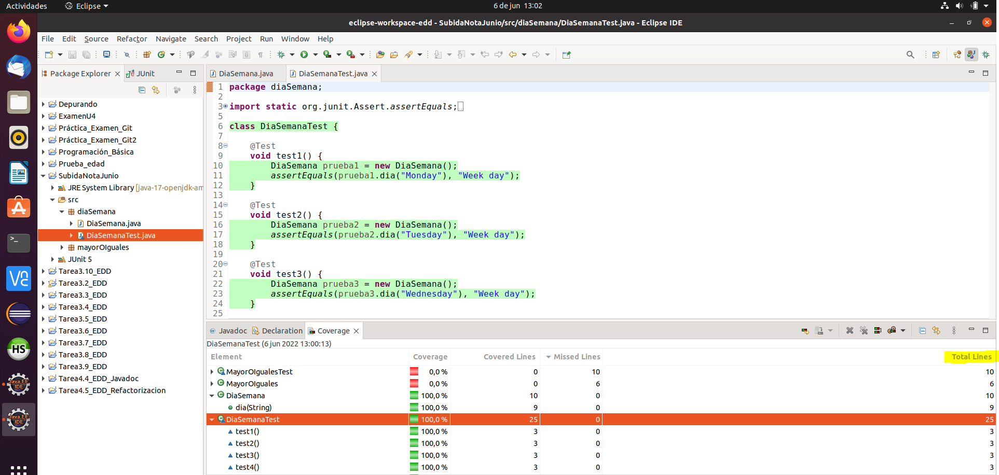

### Métodos

### Complejidad

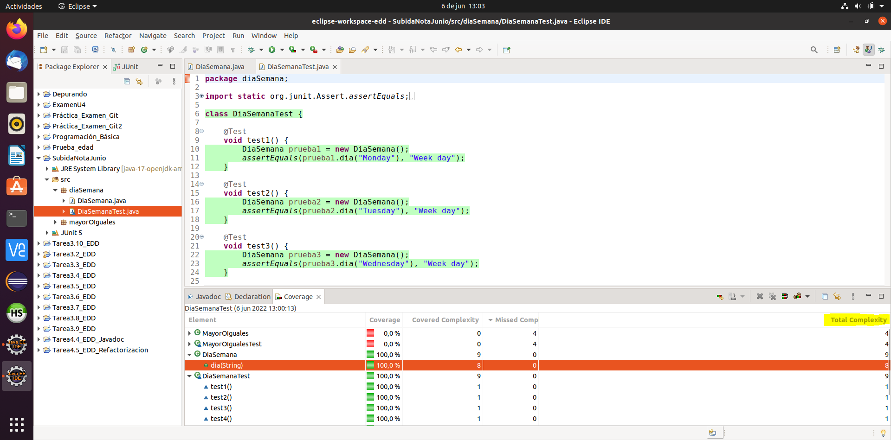